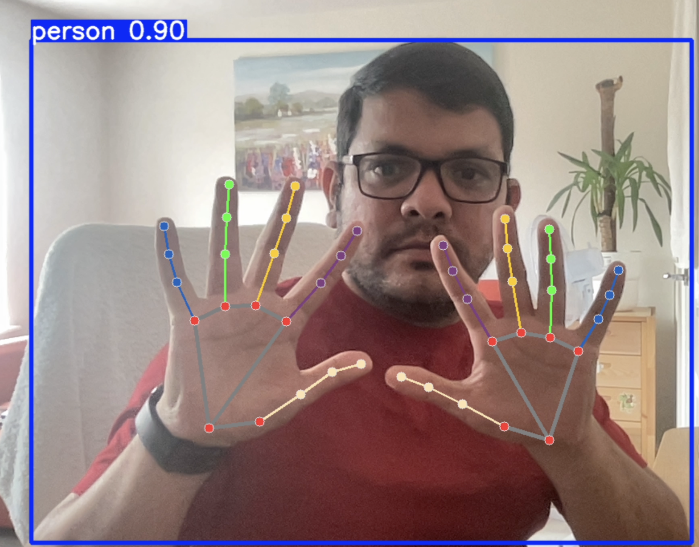

# 🛒 RetailGuardAI

> An AI-powered smart surveillance system to detect suspicious item-picking behavior in retail stores.

RetailGuardAI is a Python-based project that uses cutting-edge computer vision and machine learning to monitor retail store environments. It detects when a person picks up an item from a shelf and tracks whether it's placed in a basket, pocket, or left behind—helping identify potential theft or unusual behavior.

---

## 📸 Features

- 🔍 Human, hand, and object detection using YOLOv8 and Mediapipe
- 🎯 Shelf zone detection using Region of Interest (ROI) mapping
- 🚶 Object tracking via DeepSORT or ByteTrack
- 🧠 Behavior analysis to detect abnormal picking patterns
- 🛎️ Real-time alerts via email, SMS, or dashboard
- 📊 Logs of all detections with timestamp and zone information
- 🔐 Optional face blurring for GDPR compliance

---

## 🛡️ Disclaimer

This project is for educational and research purposes. Please ensure ethical and legal usage, especially in real-world retail environments. Respect customer privacy and follow data protection regulations like GDPR.

## 🚀 Project Demo

  Pending...!

---

## 🧠 Tech Stack

| Component            | Technology               |
|---------------------|--------------------------|
| Human Detection      | YOLOv8 / OpenCV           |
| Object Tracking      | DeepSORT / ByteTrack      |
| Hand Detection       | Mediapipe                |
| Behavior Logic       | Python + Custom Rules / ML |
| Alerts & UI          | Flask / Streamlit         |
| Data Storage         | SQLite / PostgreSQL       |

---

## 🗂️ Project Structure

## 🚀 Concept Demo

### Detection of person and objects

#### Code :  [Python File](./models/personandobject_detection.py)

#### Video : 

### Detection of person hands 

    Approaches to detect hands:

        Use a Specialized Hand Detection Model: 
            There are models specifically trained for hand detection (e.g., MediaPipe Hands, OpenPose, or custom-trained YOLO models on hand datasets). This is the most accurate approach for hand detection.

        Train a Custom YOLOv8 Model: 
            You could gather or create a dataset of hands and then train your own YOLOv8 model on this dataset. This is more involved and requires significant data and computational resources.

    
    I have used google mediapipe

    https://ai.google.dev/edge/mediapipe/solutions/vision/hand_landmarker

    Sample code : https://colab.research.google.com/github/googlesamples/mediapipe/blob/main/examples/hand_landmarker/python/hand_landmarker.ipynb

#### Code :  [Python File](./models/personhands_detection.py)

#### Video : 

#### Code explanation 

    MediaPipe Hand Inference and Drawing:

        frame_rgb = cv2.cvtColor(frame, cv2.COLOR_BGR2RGB): MediaPipe expects RGB images, so we convert the OpenCV BGR frame.

        hand_results = hands.process(frame_rgb): Processes the frame to detect hands.

        if hand_results.multi_hand_landmarks:: Checks if any hands were detected.

        for hand_landmarks in hand_results.multi_hand_landmarks:: Iterates through each detected hand.

        mp_drawing.draw_landmarks(...): Draws the 21 hand landmarks and connections directly onto the annotated_frame. This is very visually informative for hand poses.

