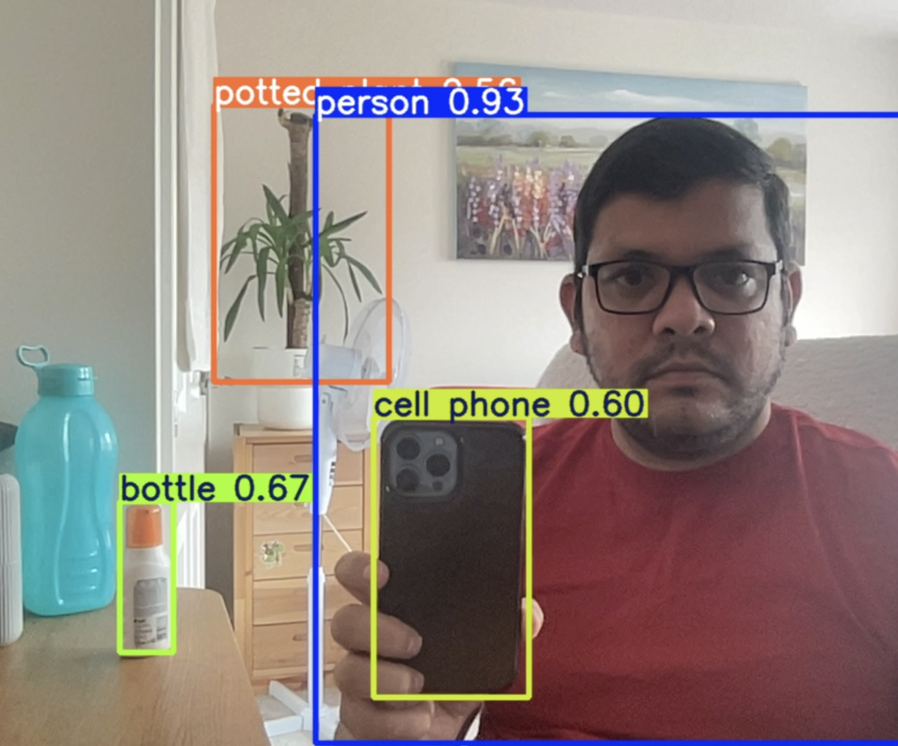

# 🛒 RetailGuardAI

> An AI-powered smart surveillance system to detect suspicious item-picking behavior in retail stores.

RetailGuardAI is a Python-based project that uses cutting-edge computer vision and machine learning to monitor retail store environments. It detects when a person picks up an item from a shelf and tracks whether it's placed in a basket, pocket, or left behind—helping identify potential theft or unusual behavior.

---

## 📸 Features

- 🔍 Human, hand, and object detection using YOLOv8 and Mediapipe
- 🎯 Shelf zone detection using Region of Interest (ROI) mapping
- 🚶 Object tracking via DeepSORT or ByteTrack
- 🧠 Behavior analysis to detect abnormal picking patterns
- 🛎️ Real-time alerts via email, SMS, or dashboard
- 📊 Logs of all detections with timestamp and zone information
- 🔐 Optional face blurring for GDPR compliance

---

## 🛡️ Disclaimer

This project is for educational and research purposes. Please ensure ethical and legal usage, especially in real-world retail environments. Respect customer privacy and follow data protection regulations like GDPR.

## 🚀 Project Demo

  Pending...!

---

## 🧠 Tech Stack

| Component            | Technology               |
|---------------------|--------------------------|
| Human Detection      | YOLOv8 / OpenCV           |
| Object Tracking      | DeepSORT / ByteTrack      |
| Hand Detection       | Mediapipe                |
| Behavior Logic       | Python + Custom Rules / ML |
| Alerts & UI          | Flask / Streamlit         |
| Data Storage         | SQLite / PostgreSQL       |

---

## 🗂️ Project Structure

## 🚀 Concept Demo

### Detection of person and objects
#### Code :  [Python File](./models/personandobject_detection.py)
#### Video : [Video File](./demo/videos/Personandobject_detection.mov)
#### Video : 
